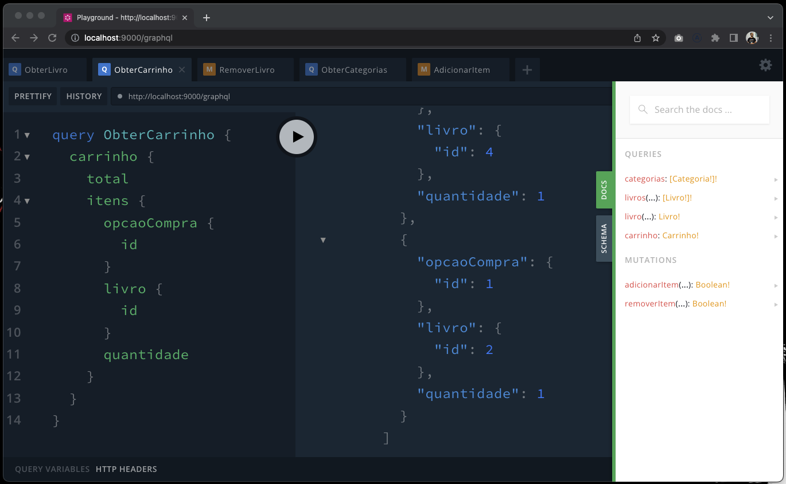

##AluraBooks

AluraBooks is an online store that sells Casa do Código books.
It's an MVP that's just beginning and still has many new features to be developed.

# JSONServer + JWT Auth + Nest & GraphQL

This is a mocked Rest API, using json-server and JWT.
Next door, we have an Apollo Server created with the help of Nest encapsulating the API calls.




## 🛠️ Installation

```bash
$ npm install
```

## 🛠️ Execution

Open a terminal and run the following command:

```bash
$ npm run start
```

Leave the previous terminal open, open a new terminal and run:

```bash
$ npm run start:api
```

Now, with both commands running, everything is ready to start the course!


## 🛠️ How to register?

You can do this by making a post request to:

```
POST http://localhost:8000/public/registrar
```

With the following data:


```
{
    "name": "kayo ennrique",
    "email": "kayo.ennrique@hotmail.com.br",
    "password": "123456",
    "address": "Rua Vergueiro, 3185",
    "complement": "Vila Mariana",
    "cep": "04101-300"
}
```

Note that email is a unique field and users with duplicate emails will not be persisted.

## 🛠️ How to log in?

You can do this by making a post request to:

```
POST http://localhost:8000/public/login
```

With the following data:


```
{
  "email": "kayo.ennrique@hotmail.com.br",
  "password":"123456"
}
```

You will receive a token in the following format:

```
{
   "access_token": "<ACCESS_TOKEN>",
   "user": { ... user data ... }
}
```

## Authenticate upcoming requests?

And then, add this same token to the header of the next requests:

```
Authorization: Bearer <ACCESS_TOKEN>
```

## 📚 More course information

AluraBooks is the project used throughout the training, and this API will be used in several different courses :)
